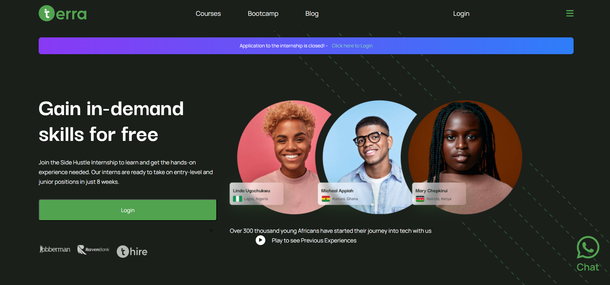

# SideHustle Bootcamp - Terra website rebuild solution

This is a solution to the [Terra landing page with two column layout challenge](https://lms.terrahq.co/). SideHustle Bootcamp challenges help you improve your coding skills by building realistic projects. 

## Table of contents

- [Overview](#overview)
  - [The challenge](#the-challenge)
  - [Screenshot](#screenshot)
  - [Links](#links)
- [My process](#my-process)
  - [Built with](#built-with)
  - [What I learned](#what-i-learned)
  - [Continued development](#continued-development)
  - [Useful resources](#useful-resources)
- [Author](#author)
- [Acknowledgments](#acknowledgments)

## Overview

### The challenge

Users should be able to:

- View the optimal layout for the site depending on their device's screen size
- See hover states for all interactive elements on the page

### Screenshot

### Links

- Solution URL: [Add solution URL here](https://github.com/lawal-sherif-itunu/terra-website.git)
- Live Site URL: [Add live site URL here](https://lawal-sherif-itunu.github.io/terra-website/)

## My process

### Built with

- Semantic HTML5 markup
- CSS custom properties
- Flexbox
- CSS Grid
- Mobile-first workflow

### What I learned

I learnt and revised how to grid and flex.

### Continued development

Continuing my javascript

### Useful resources

- [Example resource 1](https://www.youtube.com/watch?v=rg7Fvvl3taU) - This helped me for learning grid.

## Author

- Website - [Lawal Sherif](https://github.com/lawal-sherif-itunu)
- LinkedIn - [@sherif-lawal](https://www.linkedin.com/in/sherif-lawal/)
- Twitter - [@SherifLawal12](https://twitter.com/SherifLawal12)

## Acknowledgments

Big thanks to my frontend team for always checking up on me that I am consistent. Also big thanks to BlockchainOAU (Nonse in particular). Also I want to use this medium to appreciate my ever supportive boss at web3schools.
